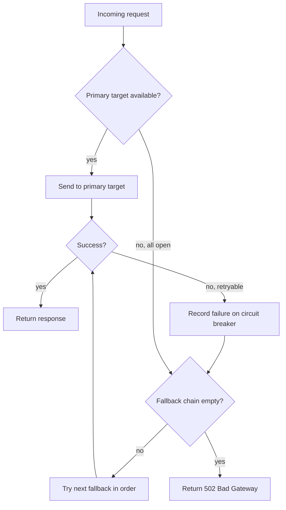
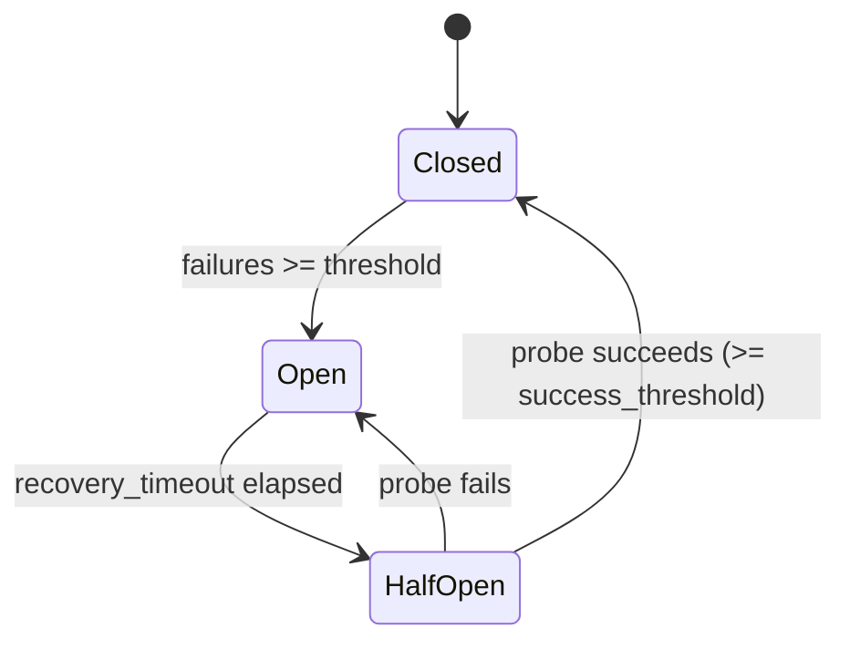

# Routing

Ferrox routes each model alias to a pool of provider targets. The pool has a primary strategy and an optional fallback chain.

## Request dispatch flow



## Routing strategies

### round_robin

Cycles through available targets in order. Best for spreading load across targets with similar capacity.

```yaml
routing:
  strategy: round_robin
  targets:
    - provider: anthropic-key-1
      model_id: claude-sonnet-4-20250514
    - provider: anthropic-key-2
      model_id: claude-sonnet-4-20250514
```

### weighted

Distributes traffic proportionally by weight. Weights are reduced by their GCD and expanded into a slot array at startup; there is no runtime division.

```yaml
routing:
  strategy: weighted
  targets:
    - provider: anthropic-primary
      model_id: claude-sonnet-4-20250514
      weight: 70
    - provider: anthropic-secondary
      model_id: claude-sonnet-4-20250514
      weight: 30
```

All targets must have a `weight` when using this strategy.

### failover

Always sends to the first available target. Moves to the next only when the current one is unavailable (circuit open).

```yaml
routing:
  strategy: failover
  targets:
    - provider: anthropic-primary
      model_id: claude-opus-4-20250514
```

### random

Picks a random available target for each request. Useful for distributing load without strict ordering.

```yaml
routing:
  strategy: random
  targets:
    - provider: provider-a
      model_id: some-model
    - provider: provider-b
      model_id: some-model
```

---

## Fallback chains

When all primary targets fail (or their circuit breakers are open), Ferrox tries the fallback list in order.

```yaml
models:
  - alias: claude-sonnet
    routing:
      strategy: weighted
      targets:
        - provider: anthropic-primary
          model_id: claude-sonnet-4-20250514
          weight: 70
        - provider: anthropic-secondary
          model_id: claude-sonnet-4-20250514
          weight: 30
      fallback:
        - provider: bedrock-us
          model_id: anthropic.claude-3-5-sonnet-20241022-v2:0
```

Fallback targets also have individual circuit breakers. A fallback with an open circuit is skipped.

---

## Circuit breakers

Each provider-model combination has an independent circuit breaker. It prevents cascading failures by stopping requests to a provider that is consistently failing.

### State machine



### States

| State | Behavior |
|---|---|
| **Closed** | Normal operation. Failures are counted. |
| **Open** | All requests to this target are rejected immediately. |
| **HalfOpen** | One probe request is allowed through. Success closes the circuit; failure re-opens it. |

Only one probe request is permitted at a time in HalfOpen state, preventing a thundering herd on recovery.

### Configuration

```yaml
defaults:
  circuit_breaker:
    failure_threshold: 5      # consecutive failures before opening
    success_threshold: 2      # successful probes needed to close
    recovery_timeout_secs: 30 # how long to wait before trying a probe
```

Per-provider overrides are supported; see [Configuration](configuration.md).

---

## Retries

Before trying the fallback chain, Ferrox retries the same target for transient errors. Backoff is exponential with optional jitter.

Backoff formula: `min(initial_ms * 2^attempt, max_ms) + random(0, initial_ms)`

```yaml
defaults:
  retry:
    max_attempts: 3
    initial_backoff_ms: 100
    max_backoff_ms: 2000
    jitter: true
```

### Retryable errors

| Error | Retried? |
|---|---|
| Upstream timeout | yes |
| Circuit open | yes |
| Provider 5xx | yes |
| Provider 429 | yes |
| Stream error | yes |
| 401, 403, 404 | no |
| Rate limited (local) | no |

Non-retryable errors are returned immediately without retry or fallback.
